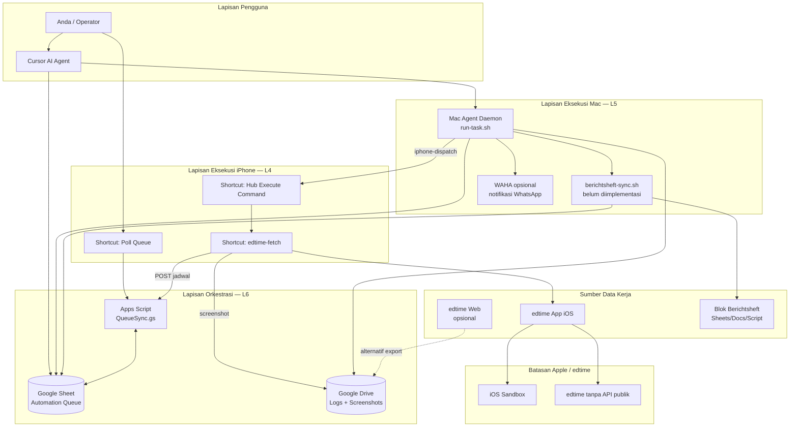
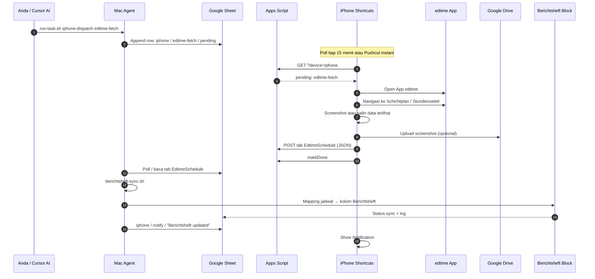
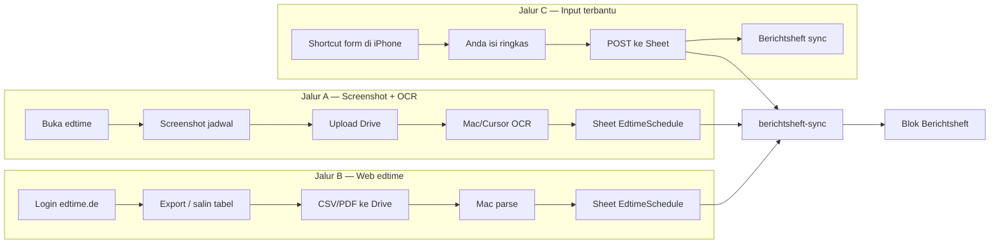
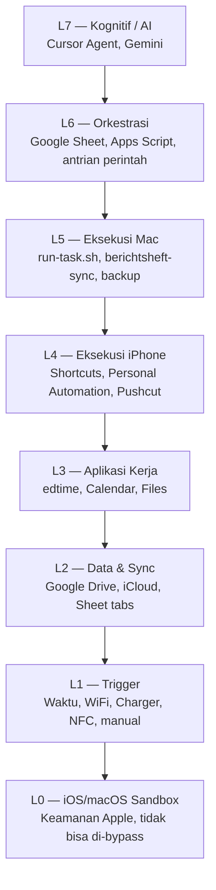
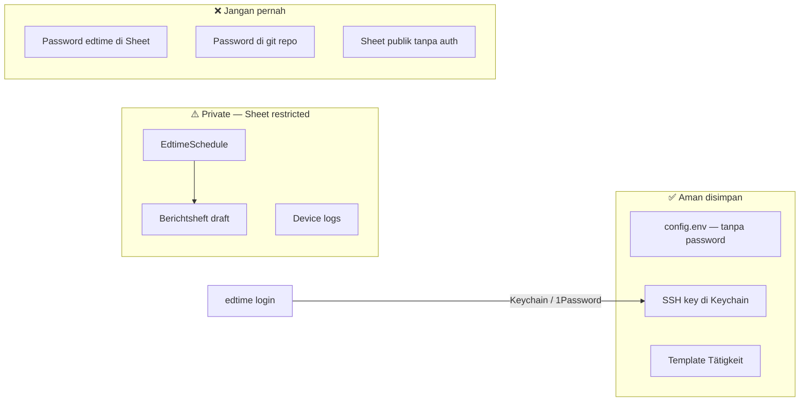
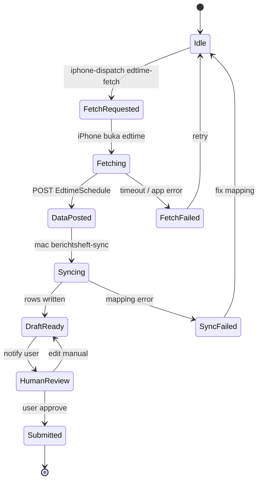
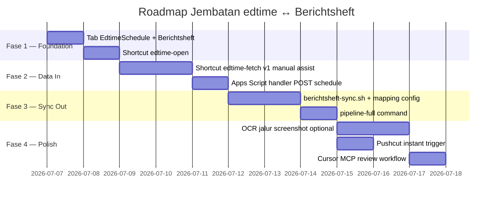

# Arsitektur Jembatan: edtime (iPhone) ↔ Berichtsheft Automation

Dokumen ini memetakan **skema arsitektur lengkap** untuk menghubungkan:

- **edtime Mitarbeiter-App** di iPhone (jadwal kerja, jam masuk/keluar, absensi)
- **Blok Berichtsheft Automation** (laporan harian Ausbildung / magang)
- **Mac ↔ iPhone Automation Hub** (orkestrasi pusat yang sudah ada di repo)

> **Konteks:** Cloud Agent (Cursor AI) **tidak bisa** langsung mengontrol iPhone. Arsitektur ini menjembatani lewat **Mac Agent + Google Sheet + Shortcuts iPhone** — pola legal dan sudah didukung Apple.

---

## 1. Ringkasan Eksekutif

| Aspek | Keterangan |
|-------|------------|
| **Tujuan** | Ambil data jadwal/kerja dari edtime → gabungkan otomatis ke Blok Berichtsheft |
| **Pusat orkestrasi** | Google Sheet + Mac Agent (`run-task.sh`) |
| **Trigger** | Cursor AI, jadwal waktu, Pushcut, atau manual dari iPhone |
| **Eksekusi iPhone** | Shortcuts (buka edtime, kumpulkan data, POST ke Sheet) |
| **Eksekusi Mac** | Script sync Berichtsheft, backup, notifikasi balik ke iPhone |
| **Kontrol penuh HP** | ❌ Tidak didukung Apple — hanya perintah yang Anda definisikan |
| **API edtime publik** | ❌ Tidak ada — data harus lewat app UI, web, atau export manual |

---

## 2. Diagram Arsitektur Utama

### 2.1 Vista tingkat sistem (System Context)



### 2.2 Alur data end-to-end (Sequence)



### 2.3 Tiga jalur ekstraksi data edtime



| Jalur | Akurasi | Otomasi | Butuh Mac? | Rekomendasi |
|-------|---------|---------|------------|-------------|
| **A — Screenshot+OCR** | Sedang | Tinggi | Ya (proses OCR) | Jika hanya app mobile |
| **B — Web export** | Tinggi | Tinggi | Ya | **Paling disarankan** jika web diizinkan |
| **C — Input terbantu** | Tinggi | Rendah | Opsional | Fallback paling aman |

---

## 3. Model Lapisan (Layer Model)



| Lapisan | Komponen | Peran dalam jembatan edtime↔Berichtsheft |
|---------|----------|------------------------------------------|
| **L7** | Cursor AI | Generate perintah, review data, koreksi mapping |
| **L6** | Sheet `Queue`, `EdtimeSchedule`, `Berichtsheft` | Bus data & status sync |
| **L5** | Mac Agent, `berichtsheft-sync.sh` | Transformasi data, isi Blok Berichtsheft |
| **L4** | Shortcuts `edtime-open`, `edtime-fetch` | Buka app, kumpulkan data dari UI |
| **L3** | edtime app, Berichtsheft target | Sumber & tujuan data kerja |
| **L2** | Drive, Sheet | Persistensi & audit trail |
| **L1** | Automation 15 menit, charger malam | Trigger sync otomatis |
| **L0** | Sandbox iOS | **Batas utama** — tidak ada akses daemon penuh |

---

## 4. Komponen & Mapping ke Repo

| Komponen arsitektur | Status | File / lokasi di repo |
|---------------------|--------|------------------------|
| Antrian perintah pusat | ✅ Ada | `google/SHEET-TEMPLATE.md`, `QueueSync.gs` |
| Dispatch Mac → iPhone | ✅ Ada | `mac/scripts/iphone-dispatch.sh` |
| Registry perintah iPhone | ✅ Ada | `iphone/command-registry.json` |
| Router Shortcut | ✅ Ada | `iphone/hub-execute-command.shortcut-spec.json` |
| Peta arsitektur iPhone | ✅ Ada | `docs/IPHONE-ARCHITECTURE-MAP.md` |
| Tab `EdtimeSchedule` | 🔲 Direncanakan | Tambah di Google Sheet |
| Tab `Berichtsheft` | 🔲 Direncanakan | Sesuai format Blok Anda |
| Shortcut `edtime-fetch` | 🔲 Direncanakan | `iphone/edtime-fetch.shortcut-spec.json` |
| Script `berichtsheft-sync.sh` | 🔲 Direncanakan | `mac/scripts/berichtsheft-sync.sh` |
| Handler Apps Script edtime | 🔲 Direncanakan | Extend `QueueSync.gs` |

---

## 5. Skema Tab Google Sheet (Data Bus)

### Tab: `EdtimeSchedule` (input dari iPhone/Mac)

| Kolom | Tipe | Contoh | Sumber |
|-------|------|--------|--------|
| `id` | UUID | `a1b2c3d4` | Auto |
| `date` | ISO date | `2026-07-06` | edtime Schichtplan |
| `start_time` | HH:MM | `15:30` | edtime |
| `end_time` | HH:MM | `00:00` | edtime |
| `shift_code` | text | `SpV` | edtime |
| `break_minutes` | number | `30` | edtime Stundenzettel |
| `location` | text | `Station A` | edtime / manual |
| `status` | enum | `planned\|worked\|absent` | edtime |
| `raw_source` | enum | `app\|web\|manual\|ocr` | metadata |
| `synced_at` | timestamp | ISO | Apps Script |
| `berichtsheft_row` | ref | `BS-2026-W27-D1` | setelah sync |

### Tab: `Berichtsheft` (output otomasi)

| Kolom | Tipe | Contoh | Diisi oleh |
|-------|------|--------|------------|
| `week` | KW | `KW27` | sync script |
| `date` | date | `2026-07-06` | dari EdtimeSchedule |
| `betrieb` | text | Nama perusahaan | config / template |
| `abteilung` | text | Dept | config |
| `taetigkeit` | text | Aktivitas harian | **mapping dari shift + template** |
| `stunden` | decimal | `8.5` | hitung dari start/end − break |
| `bemerkung` | text | Catatan | opsional |
| `status` | enum | `draft\|ready\|submitted` | workflow |
| `source_edtime_id` | ref | `a1b2c3d4` | traceability |

### Tab: `Queue` (perintah — sudah ada)

Contoh baris baru untuk pipeline edtime:

| id | device | command | status | args |
|----|--------|---------|--------|------|
| x1 | iphone | edtime-fetch | pending | week=current |
| x2 | mac | berichtsheft-sync | pending | week=KW27 |
| x3 | iphone | notify | pending | Jadwal + Berichtsheft selesai |

---

## 6. Perintah Baru (Command Registry — rencana)

| command | device | args | Efek |
|---------|--------|------|------|
| `edtime-open` | iphone | — | Buka app edtime |
| `edtime-fetch` | iphone | `week=current` | Buka edtime → ambil jadwal → POST Sheet |
| `edtime-post-schedule` | iphone | JSON inline | Tulis langsung ke webhook |
| `berichtsheft-sync` | mac | `week=KW27` | Baca EdtimeSchedule → isi Berichtsheft |
| `berichtsheft-preview` | mac | `date=2026-07-06` | Generate draft tanpa submit |
| `pipeline-full` | mac | — | edtime-fetch (dispatch) → tunggu → sync |

---

## 7. Batasan (Limitations) — Wajib Diketahui

### 7.1 Batasan platform Apple

| Batasan | Dampak pada pipeline | Workaround |
|---------|---------------------|------------|
| iOS tidak izinkan daemon background permanen | Poll antrian max ~15 menit; task >30s bisa gagal | Pushcut Automation Server |
| Tidak bisa baca UI app lain secara native | edtime data tidak otomatis ter-export | Screenshot+OCR, web export, input form |
| Layar terkunci | Shortcut sering gagal untuk navigasi panjang | Jalankan saat unlocked + charger |
| App Intents edtime tidak publik | Tidak ada aksi resmi "Get Schedule" | Custom Shortcut + manual steps |
| Tidak force-quit / deep control app | Hanya `Open App` + tap terbatas | Appium + Mac (setup berat) |

### 7.2 Batasan edtime (eurodata)

| Batasan | Dampak | Workaround |
|---------|--------|------------|
| Tidak ada API publik developer | Tidak bisa GET /schedule via HTTP | Web UI, screenshot, manual export |
| Akun dari employer | Tanpa login, tidak ada data | Pastikan kredensial di Keychain, bukan Sheet |
| Fitur shift plan butuh edtime PLUS | Mungkin jadwal terbatas | Konfirmasi ke HR |
| Data sensitif (GDPR) | Tidak boleh log sembarangan | Sheet private, tidak commit password |
| UI bisa berubah tiap update app | OCR / tap coordinates rusak | Prefer web export; version pin Shortcut |

### 7.3 Batasan Cloud Agent (Cursor AI)

| Batasan | Dampak | Workaround |
|---------|--------|------------|
| Tidak akses iPhone langsung | AI tidak bisa "buka edtime sekarang" | Mac Agent + Sheet queue |
| Tidak akses layar real-time | Tidak verifikasi visual otomatis | Screenshot ke Drive → AI review |
| Session terpisah dari Mac Anda | Perintah harus lewat infrastruktur Hub | Install daemon di Mac rumah |

### 7.4 Batasan Berichtsheft

| Batasan | Dampak | Workaround |
|---------|--------|------------|
| Format Blok bisa unik per sekolah/Ausbilder | Mapping tidak one-size-fits-all | Config `berichtsheft-mapping.json` |
| Narasi harian butuh konteks manusia | Otomasi hanya isi struktur + jam | Template Tätigkeit + edit manual |
| Tanda tangan / submit resmi | Tidak bisa otomatis di semua sistem | Status `ready` → Anda review & submit |

---

## 8. Fitur yang Didapat Jika Dijembatani & Dieksekusi

| Fitur | Deskripsi |
|-------|-----------|
| **Satu perintah pipeline** | `pipeline-full` dari Cursor/Mac → fetch edtime → sync Berichtsheft |
| **Audit trail** | Semua data punya `source_edtime_id`, timestamp, `raw_source` |
| **Trigger terjadwal** | Sync malam saat iPhone charge (Automation sudah ada di Hub) |
| **Notifikasi balik** | iPhone dapat alert "Berichtsheft minggu KW27 siap review" |
| **AI review** | Cursor baca Sheet + Drive, koreksi Tätigkeit sebelum submit |
| **Fallback multi-jalur** | App screenshot, web export, atau input manual — tetap satu output |
| **Integrasi WhatsApp opsional** | WAHA kirim ringkasan jadwal ke Anda / Ausbilder (draft) |
| **SSH dari iPhone** | Trigger pipeline dari widget/Siri di luar rumah (via Tailscale) |

---

## 9. Kelebihan & Kekurangan

### 9.1 Kelebihan (Pros)

| # | Kelebihan | Penjelasan |
|---|-----------|------------|
| 1 | **Legal & tanpa jailbreak** | Memakai Shortcuts, Sheet, SSH — semua didukung Apple |
| 2 | **Modular** | edtime dan Berichtsheft terpisah; ganti salah satu tanpa rombak total |
| 3 | **Sudah ada fondasi** | 80% infrastruktur ada di `mac-iphone-automation` |
| 4 | **AI sebagai orkestrator** | Cursor generate/monitor tanpa pegang HP langsung |
| 5 | **Traceability** | Setiap baris Berichtsheft bisa dilacak ke baris edtime |
| 6 | **Gratis (core)** | Google Sheet + Shortcuts + Mac — tanpa biaya SaaS tambahan |
| 7 | **Skalabel ke app lain** | Pola sama untuk Calendar, Reminders, dll. |

### 9.2 Kekurangan (Cons)

| # | Kekurangan | Penjelasan |
|---|------------|------------|
| 1 | **Bukan kontrol HP penuh** | Tidak seperti remote desktop; hanya perintah terdefinisi |
| 2 | **Latency** | Poll 15 menit (kecuali Pushcut) — bukan real-time |
| 3 | **Rapuh terhadap update edtime** | UI berubah → Shortcut/OCR perlu maintenance |
| 4 | **Butuh Mac menyala** | Daemon Mac untuk sync Berichtsheft & OCR |
| 5 | **Setup awal kompleks** | Sheet, Apps Script, Shortcuts, SSH, signing — beberapa jam |
| 6 | **Narrative Berichtsheft tidak 100% otomatis** | Tätigkeit detail tetap butuh template atau edit manusia |
| 7 | **Kredensial & privasi** | Salah konfigurasi bisa expose data kerja di Sheet |
| 8 | **edtime web tidak selalu tersedia** | Tergantung kebijakan employer |

### 9.3 Matriks keputusan: layak vs tidak layak

| Skenario Anda | Layak dijembatani? |
|---------------|-------------------|
| Punya Mac + iPhone + akun edtime + Blok Berichtsheft di Google | ✅ **Sangat layak** |
| Hanya iPhone, tanpa Mac | ⚠️ Terbatas — manual + Shortcuts saja |
| Butuh 100% otomatis tanpa sentuh HP | ❌ Tidak realistis di iOS |
| Butuh akurasi jam kerja tinggi | ✅ Layak jika pakai web export atau input terbantu |
| Employer melarang export data | ❌ Hanya manual — otomasi penuh berisiko kebijakan |

---

## 10. Diagram Keamanan & Data Sensitif



**Aturan keamanan pipeline:**

1. Kredensial edtime → **1Password CLI** atau **iOS Keychain** (lihat `docs/ACCOUNTS.md`)
2. Google Sheet → share hanya akun Anda + service account Apps Script
3. Screenshot jadwal → folder Drive `Automation Hub/Edtime/` — bukan publik
4. Jangan commit `config.env` dengan token ke git

---

## 11. State Machine Sync



| State | Siapa yang bertanggung jawab | Aksi jika gagal |
|-------|------------------------------|-----------------|
| `FetchRequested` | Mac → Sheet | Cek Pushcut / poll interval |
| `Fetching` | iPhone Shortcut | Pastikan unlocked, edtime login |
| `DataPosted` | Apps Script | Validasi JSON schema |
| `Syncing` | Mac script | Cek `berichtsheft-mapping.json` |
| `DraftReady` | Anda | Review Tätigkeit |
| `Submitted` | Anda / sistem sekolah | Manual jika perlu |

---

## 12. Perbandingan Alternatif Arsitektur

| Alternatif | Otomasi | Setup | Kontrol HP | Rekomendasi |
|------------|---------|-------|------------|-------------|
| **A — Hub (dokumen ini)** | Tinggi | Sedang | Terbatas legal | ✅ **Utama** |
| **B — Appium + Mac** | Sangat tinggi | Sulit | UI-level | Jika A gagal & punya Mac |
| **C — Manual + Sheet** | Rendah | Mudah | Manual | Fallback |
| **D — Cloud Agent langsung** | — | — | ❌ Impossible | Tidak viable |
| **E — Jailbreak** | Tinggi | — | Penuh | ❌ Tidak disarankan |

---

## 13. Roadmap Implementasi



| Fase | Deliverable | Hasil |
|------|-------------|-------|
| **1** | Sheet tabs + `edtime-open` | Bisa buka edtime dari perintah Hub |
| **2** | `edtime-fetch` + webhook | Data jadwal masuk Sheet |
| **3** | `berichtsheft-sync.sh` | Blok Berichtsheft terisi draft |
| **4** | OCR + Pushcut + AI review | Pipeline hampir hands-free |

---

## 14. Contoh Eksekusi (Perintah)

```bash
# 1. Minta iPhone ambil jadwal edtime minggu ini
~/.edtime-sync/run-edtime.sh iphone-dispatch edtime-fetch "week=current"

# 2. Setelah data di Sheet (atau tunggu poll iPhone)
~/.edtime-sync/run-edtime.sh berichtsheft-sync "week=KW27"

# 3. Pipeline lengkap (setelah script diimplementasi)
~/.edtime-sync/run-edtime.sh pipeline-full

# 4. Dari Cursor natural language → setara dengan baris di atas
#    Agent tulis baris ke Sheet Queue atau panggil run-task via SSH
```

---

## 15. Kesimpulan Arsitektural

| Pertanyaan | Jawaban |
|------------|---------|
| Apakah bisa dijembatani? | ✅ **Ya**, via Automation Hub yang sudah ada |
| Apakah AI bisa kontrol HP langsung? | ❌ **Tidak** — harus lewat Mac + Shortcuts + Sheet |
| Apakah semua data edtime otomatis? | ⚠️ **Sebagian** — tergantung jalur A/B/C |
| Apakah Berichtsheft 100% otomatis? | ⚠️ **Draft otomatis** — review manusia disarankan |
| Apakah layak dieksekusi? | ✅ **Layak** jika punya Mac + iPhone + akses edtime |

**Rekomendasi jalur utama:** `edtime web export (B)` → `Sheet EdtimeSchedule` → `berichtsheft-sync.sh` → `review` → `submit`

**Fallback:** `edtime-fetch Shortcut (A/C)` saat web tidak tersedia.

---

## Referensi Internal

- [`IPHONE-ARCHITECTURE-MAP.md`](IPHONE-ARCHITECTURE-MAP.md) — peta kontrol iPhone lengkap
- [`PERMISSIONS-AND-WORKAROUNDS.md`](PERMISSIONS-AND-WORKAROUNDS.md) — izin & workaround
- [`../iphone/command-registry.json`](../iphone/command-registry.json) — registry perintah
- [`../google/SHEET-TABS-MAP.md`](../google/SHEET-TABS-MAP.md) — struktur tab Sheet
- [edtime App Store](https://apps.apple.com/us/app/edtime-mitarbeiter-app/id1068194431)
- [edtime.de](https://www.edtime.de/)

---

*Dokumen v1.0 — arsitektur rencana. Komponen bertanda 🔲 belum diimplementasi; fondasi Hub bertanda ✅ sudah tersedia di repo.*
