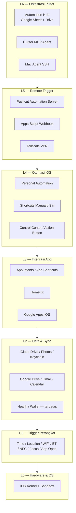
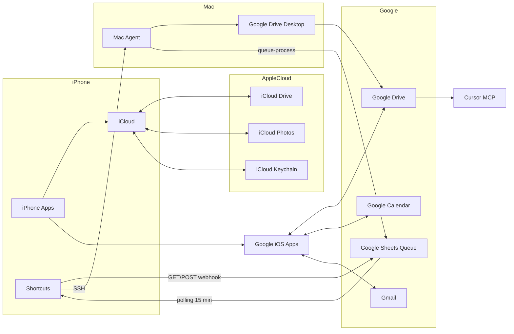
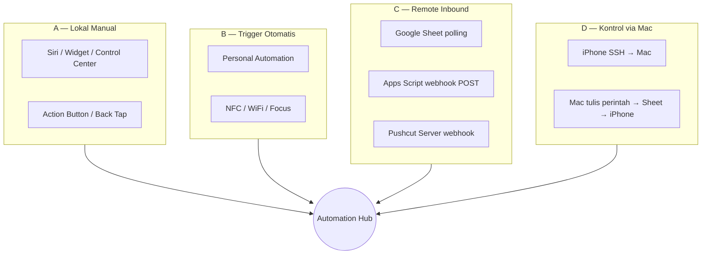
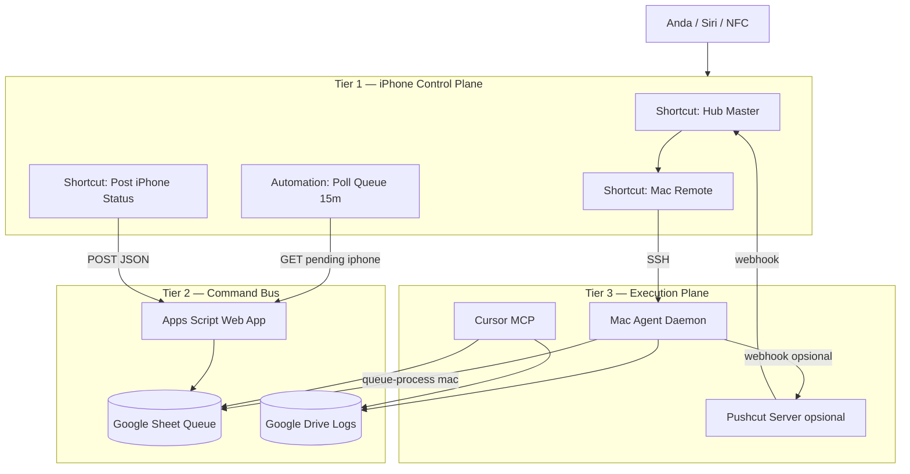
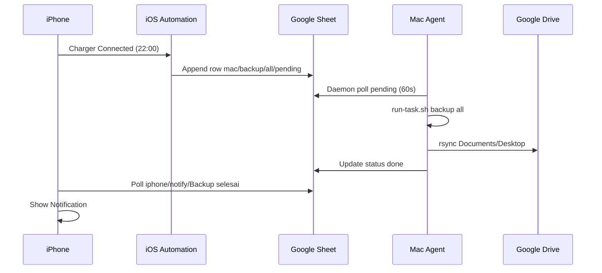

# Arsitektur & Mapping Kontrol iPhone

Dokumen ini memetakan **seluruh celah kontrol dan integrasi iPhone** yang tersedia secara legal (tanpa jailbreak), batasannya, dan bagaimana semuanya terhubung ke **Automation Hub** Anda.

> **Prinsip iOS:** Apple mengontrol eksekusi. Tidak ada daemon background permanen seperti Linux/Android. Otomatisasi = **trigger sistem** + **Shortcuts/App Intents** + **middleware cloud** (Google Sheet, Pushcut, Mac SSH).

---

## 1. Model Lapisan (Layer Stack)

| Lapisan | Peran | Kontrol penuh? |
|---------|-------|----------------|
| **L0** | iOS sandbox, keamanan, battery | ❌ Tidak bisa di-bypass |
| **L1** | Event trigger (WiFi, Focus, dll.) | ⚠️ Hanya saat event terjadi |
| **L2** | Sinkron data antar layanan | ⚠️ iCloud/Google sync = system-managed |
| **L3** | Aksi per-app (App Intents) | ⚠️ Per app yang expose intent |
| **L4** | Shortcuts + Automation | ⚠️ Foreground / trigger-bound |
| **L5** | Trigger dari luar (webhook, Mac) | ⚠️ Butuh Pushcut atau polling |
| **L6** | Orkestrasi Mac + Google + Cursor | ✅ Pusat perintah Anda |

---

## 2. Peta Kontrol per Domain Sistem

### 2.1 Matriks Kemampuan

| Domain | Shortcuts | Personal Automation | App Intents | Remote (Hub) | Batas utama |
|--------|-----------|---------------------|-------------|--------------|-------------|
| **File lokal iPhone** | ⚠️ Picker manual | ❌ | ⚠️ Container app | ❌ | Tidak akses folder sistem |
| **iCloud Drive** | ✅ Baca/tulis | ⚠️ | ⚠️ | ❌ | Sync timing = iOS decide |
| **Google Drive** | ⚠️ Open URL / API | ❌ | ⚠️ App Google | ✅ Via webhook | Save File action = iCloud only |
| **Foto** | ✅ Album terpilih | ⚠️ | ⚠️ | ❌ | Perlu izin Photos |
| **Kontak** | ✅ | ❌ | ⚠️ | ❌ | Per app |
| **Kalender** | ✅ Apple + Google sync | ⚠️ | ⚠️ | ✅ Tulis via API Google | |
| **Reminders** | ✅ | ⚠️ | ⚠️ | ✅ Sheet → Shortcut | |
| **Mail** | ⚠️ Apple Mail actions | ❌ | ⚠️ Gmail app | ✅ Gmail API dari Mac | |
| **Pesan SMS/iMessage** | ⚠️ Send message (konfirmasi) | ❌ | ❌ | ❌ | Tidak baca inbox otomatis |
| **Telepon** | ⚠️ Call contact | ❌ | ❌ | ❌ | |
| **Focus / DND** | ✅ Set Focus | ✅ Trigger on/off | ⚠️ | ⚠️ Via Shortcut | |
| **WiFi / Bluetooth** | ❌ Toggle langsung | ✅ Trigger connect | ❌ | ❌ | Tidak matikan WiFi via Shortcuts |
| **Brightness / Volume** | ✅ | ⚠️ | ❌ | ❌ | |
| **Lokasi GPS** | ✅ Get Location | ✅ Arrive/Leave | ❌ | ⚠️ Pushcut geofence | Background terbatas |
| **App lain (buka/tutup)** | ⚠️ Open App / URL scheme | ✅ App Open trigger | ✅ App Intents | ⚠️ Pushcut | Tidak force-quit semua app |
| **HomeKit rumah pintar** | ✅ | ✅ Accessory trigger | ✅ | ✅ Pushcut HomeKit scene | |
| **Health / Fitness** | ⚠️ Baca (izin) | ❌ | ⚠️ | ❌ | Data sensitif |
| **Wallet / Apple Pay** | ❌ | ❌ | ❌ | ❌ | Tidak bisa otomatis |
| **Password / Keychain** | ⚠️ Passwords action (iOS 18+) | ❌ | ❌ | ❌ | Tidak export bulk |
| **SSH ke Mac** | ✅ Run Script Over SSH | ⚠️ | ❌ | ✅ Dari Hub | Kontrol Mac, bukan iPhone |
| **Kontrol Mac** | ✅ Via SSH | ⚠️ | ❌ | ✅ Hub daemon | |
| **Kontrol iPhone dari Mac** | ❌ Langsung | ❌ | ❌ | ⚠️ Sheet/Pushcut | Harus indirect |

**Legenda:** ✅ = andal | ⚠️ = terbatas / per-izin | ❌ = tidak didukung

---

## 3. Katalog Trigger Personal Automation

Semua trigger resmi iOS (Shortcuts → Automation → Personal):

### Event & Waktu
| Trigger | Run Immediately? | Use case Hub |
|---------|------------------|--------------|
| Time of Day | ✅ | Poll antrian Sheet tiap jam |
| Alarm | ⚠️ | Morning routine |
| Sleep / Wind Down | ⚠️ | Matikan notifikasi, sync status |
| Apple Watch Workout | ✅ | Log olahraga ke Sheet |

### Lokasi & Perjalanan
| Trigger | Run Immediately? | Use case Hub |
|---------|------------------|--------------|
| Arrive / Leave | ⚠️ | Pulang → trigger Mac backup |
| Before I Commute | ⚠️ | Briefing dari Google Calendar |
| CarPlay Connect/Disconnect | ⚠️ | Mode driving |
| AirPlane Mode | ⚠️ | Pause sync |

### Komunikasi
| Trigger | Run Immediately? | Use case Hub |
|---------|------------------|--------------|
| Email (Apple Mail) | ❌ Ask | Forward ke webhook |
| Message | ❌ Ask | Terbatas |
| Transaction (Apple Pay) | ❌ Ask | Log ke Sheet |

### App & Perangkat
| Trigger | Run Immediately? | Use case Hub |
|---------|------------------|--------------|
| App Open/Close | ❌ Ask | Context switch logging |
| Battery Level | ⚠️ | Low battery → notify Mac |
| Charger Connect/Disconnect | ✅ | Night backup trigger |
| Low Power Mode | ✅ | Kurangi polling |

### Settings
| Trigger | Run Immediately? | Use case Hub |
|---------|------------------|--------------|
| Wi-Fi Network | ✅ | Rumah → sync queue |
| Bluetooth Device | ✅ | Headphone → playlist |
| Focus On/Off | ✅ | Work mode → SSH status Mac |
| NFC Tag | ✅ | Physical trigger hub action |
| Sound Recognition | ⚠️ | Doorbell → HomeKit |

---

## 4. Peta Integrasi Data (Sync Topology)

### Mapping data → channel sync

| Tipe Data | Sumber iPhone | Channel Sync | Akses Hub | Latency |
|-----------|---------------|--------------|-----------|---------|
| Dokumen kerja | Files / Drive app | Google Drive | Mac rsync + MCP | Menit |
| Antrian perintah | Shortcuts | Google Sheet | Daemon Mac + poll iPhone | 1–15 menit |
| Log status device | Shortcuts | Drive folder `Logs/` | Cursor baca MCP | Real-time POST |
| Foto | Photos | iCloud Photos | Mac Photos app | Jam (iCloud) |
| Kontak | Contacts | Google Contacts sync | API / manual | Menit |
| Kalender | Calendar / Google Cal | Google account sync | Apps Script | Menit |
| Password | Keychain / 1Password | Tidak sync ke Sheet | op CLI di Mac | On-demand |
| Pesan | Messages | ❌ Tidak sync otomatis | — | — |
| Health | Health app | iCloud encrypted | Export manual | — |
| Lokasi terakhir | Shortcuts Get Location | POST ke Sheet | Webhook | Saat trigger |

---

## 5. Empat Jalur Kontrol iPhone

| Jalur | Arah | Reliabilitas | Tanpa konfirmasi? |
|-------|------|--------------|-------------------|
| **A** | Anda → iPhone | Tinggi | ✅ Manual |
| **B** | Event → iPhone | Sedang | ⚠️ Sebagian trigger |
| **C** | Cloud/Mac → iPhone | Sedang–Tinggi* | ⚠️ Pushcut = ya |
| **D** | iPhone → Mac | Tinggi (SSH) | ✅ Dengan SSH key |

*Pushcut Automation Server = iPhone/iPad dedicated unlocked sebagai server lokal.

---

## 6. Mapping App Intents (Integrasi per Aplikasi)

App Intents (iOS 18+) = cara resmi app expose aksi ke Siri, Spotlight, Shortcuts.

| Kategori App | Contoh | Aksi via Shortcuts | Otomatisasi Hub |
|--------------|--------|-------------------|-----------------|
| **Apple System** | Calendar, Reminders, Safari, Clock | ✅ Banyak actions native | Langsung di Shortcut |
| **Productivity** | Notion, Todoist, Trello | ⚠️ App Shortcuts bawaan | Chain di Sheet queue |
| **Google** | Gmail, Drive, Calendar | ⚠️ Terbatas; lebih banyak Open URL | Apps Script + API |
| **Smart Home** | Home, Eve, Philips Hue | ✅ HomeKit actions | Pushcut scene |
| **Media** | Spotify, Apple Music | ⚠️ App-dependent | SSH Mac untuk Spotify desktop |
| **Dev** | Working Copy, GitHub | ⚠️ App Shortcuts | cursor-pull di Mac |
| **Finance** | Banking apps | ❌ Hampir tidak ada | Manual only |
| **Social** | WhatsApp, Telegram | ⚠️ Share sheet / URL scheme | Terbatas |

**Strategi:** Inventory app di iPhone Anda → Shortcuts app → search nama app → catat actions available → masukkan ke Sheet kolom `command`.

---

## 7. Arsitektur Target untuk iPhone Anda

Rekomendasi **3-tier** yang memaksimalkan kontrol legal:

### Komponen → file di repo

| Komponen | File / Doc | Peran |
|----------|------------|-------|
| Antrian perintah | `google/SHEET-TEMPLATE.md` | Bus perintah Mac ↔ iPhone |
| Webhook | `google/apps-script/QueueSync.gs` | GET pending / POST status |
| Poll iPhone | `iphone/SHORTCUTS-GUIDE.md` | Automation 15 menit |
| Kontrol Mac | `mac/scripts/run-task.sh` | Eksekutor perintah Mac |
| Log device | `iphone/status-post.shortcut-spec.json` | Spec POST status iPhone |
| Remote iPhone | Pushcut (opsional) | Webhook → Shortcut background |
| AI orchestration | `cursor/mcp.json.example` | Cursor baca/tulis Drive |

---

## 8. Mapping Perintah iPhone (Command Registry)

Tambahkan ke Sheet tab `Queue` — kolom `device=iphone`:

| command | args | Shortcut handler | Efek |
|---------|------|------------------|------|
| `notify` | Teks pesan | Show Notification | Alert user |
| `open-url` | https://... | Open URL | Buka link/Drive file |
| `focus-on` | Work / Sleep / Personal | Set Focus | Mode fokus |
| `focus-off` | — | Turn Focus Off | |
| `run-shortcut` | Nama shortcut | Run Shortcut | Chain aksi kompleks |
| `post-status` | — | Get Battery + Network → POST | Update log |
| `homekit-scene` | Scene name | HomeKit Run Scene | Smart home |
| `reminder-add` | Judul | Add Reminder | Task capture |
| `calendar-add` | Judul\|ISO date | Add Calendar Event | Scheduling |
| `ssh-mac` | subcommand args | Run Script Over SSH | Kontrol Mac |
| `backup-request` | all | ssh-mac backup all | Trigger Mac backup |

Implementasi handler: satu Shortcut **`Hub — Execute Command`** dengan action **If** per `command`.

---

## 9. Batasan Kritis (Harus Diketahui)

| Mitos | Realita |
|-------|---------|
| "Shortcuts jalan terus di background" | ❌ iOS suspend; gunakan trigger atau Pushcut |
| "Bisa kontrol semua app iPhone" | ❌ Hanya app dengan App Intents / URL scheme |
| "Mac bisa remote full iPhone" | ❌ Harus lewat Sheet webhook / Pushcut |
| "Save file ke Google Drive native" | ❌ Action Save File = iCloud; workaround = API/upload |
| "Sync iCloud on-demand" | ❌ Tidak ada API force sync |
| "Simpan password di Sheet" | ❌ Gunakan Keychain / 1Password |
| "Layar locked = Shortcut tetap jalan" | ⚠️ Sering gagal untuk task panjang (>30s) |

---

## 10. Roadmap Implementasi iPhone (Prioritas)

### Fase A — Foundation (Hari 1)
- [ ] Install Google Drive + pastikan login sama dengan Mac
- [ ] Buat Sheet + Apps Script (sudah ada di repo)
- [ ] Shortcut: **Hub — Execute Command** (registry §8)
- [ ] Automation: Poll queue setiap 15 menit, WiFi rumah only

### Fase B — Status & Visibility (Hari 2)
- [ ] Shortcut **Hub — Post iPhone Status** → POST ke webhook
- [ ] Tab Sheet `Devices` untuk log Mac + iPhone
- [ ] Widget iOS: tombol Status Mac + Backup

### Fase C — Remote Control (Hari 3)
- [ ] SSH shortcuts ke Mac (sudah di SHORTCUTS-GUIDE)
- [ ] Tailscale untuk akses luar rumah
- [ ] (Opsional) Pushcut server di iPhone/iPad lama

### Fase D — App Coverage (Minggu 2)
- [ ] Audit: buka Shortcuts → cari setiap app → dokumentasi actions
- [ ] Tambah baris di Sheet per workflow (Gmail, Calendar, HomeKit, dll.)
- [ ] Chain shortcuts kompleks via `run-shortcut`

### Fase E — AI Layer (Minggu 3)
- [ ] Cursor MCP Google Drive
- [ ] Agent generate perintah baru di Sheet dari natural language

---

## 11. Diagram Alur End-to-End

**Skenario: "Backup Mac saat iPhone charge malam hari"**

---

## 12. Checklist Audit iPhone Pribadi

Jalankan audit ini di iPhone Anda dan isi tab Sheet `Inventory`:

| # | Item | Cara cek | Actions tersedia? |
|---|------|----------|-------------------|
| 1 | App produktivitas utama | Shortcuts → + → search app | |
| 2 | Google apps terinstall | App Library | |
| 3 | HomeKit accessories | Home app | |
| 4 | Focus modes | Settings → Focus | |
| 5 | NFC tags | Optional purchase | |
| 6 | Tailscale | App Store install | |
| 7 | 1Password | App + Face ID | |
| 8 | Remote Login Mac | Test SSH shortcut | |

---

## Referensi

- [Apple Shortcuts — Personal Automation](https://support.apple.com/guide/shortcuts/create-a-new-personal-automation-apdfbdbd7123/ios)
- [Apple Shortcuts — Setting Triggers](https://support.apple.com/guide/shortcuts/setting-triggers-apde31e9638b/ios)
- [App Intents — Apple Developer](https://developer.apple.com/documentation/appintents)
- [Pushcut Automation Server](https://pushcut.io/support/automation-server)
- Repo: `iphone/SHORTCUTS-GUIDE.md`, `google/SHEET-TEMPLATE.md`

---

*Dokumen ini adalah peta maksimal kontrol iPhone dalam ekosistem Apple + Automation Hub. Perbarui tab `Inventory` di Sheet saat menambah app atau workflow baru.*
