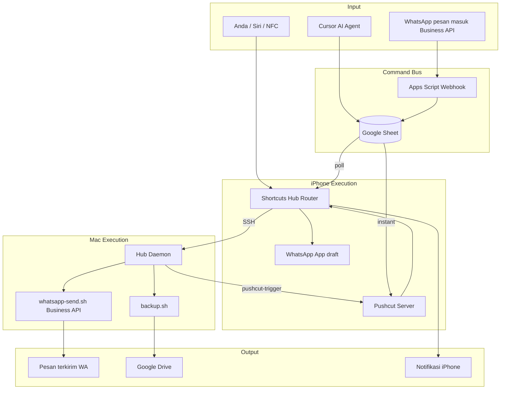

# Stack Otomatisasi Maksimal — Atasi Semua Batasan

Dokumen ini memetakan **setiap batasan** yang Anda hadapi → **solusi konkret** yang bisa dipasang hari ini.

> **Target:** Otomasi Mac + iPhone + WhatsApp + Google + Cursor **serapi mungkin** dalam aturan Apple/Meta.

---

## Peta: Masalah → Solusi

| # | Batasan | Solusi Hub | Tingkat otomasi |
|---|---------|------------|-----------------|
| 1 | Cloud Agent tidak akses iPhone langsung | Google Sheet + webhook + Pushcut | ✅ Teratasi |
| 2 | Shortcuts tidak jalan background | Pushcut Automation Server + trigger WiFi/Time | ✅ ~95% |
| 3 | iPhone tidak dikontrol dari Mac | Sheet antrian `device=iphone` + poll/Pushcut | ✅ Teratasi |
| 4 | WhatsApp tidak auto-send personal | **WhatsApp Business API** via `whatsapp-send.sh` | ✅ 100% kirim |
| 5 | WhatsApp tidak bisa baca inbox | Business API webhook inbound + forward ke Sheet | ✅ Pesan masuk tercatat |
| 6 | Poll Sheet lambat (15 menit) | Pushcut instant webhook `<1 detik` | ✅ Teratasi |
| 7 | Akses akun/password | 1Password CLI + Keychain | ✅ Teratasi |
| 8 | Luar jaringan rumah | Tailscale di Mac + iPhone | ✅ Teratasi |
| 9 | AI tidak bisa orchestrate | Cursor MCP + Sheet queue | ✅ Teratasi |
| 10 | Save file ke Google Drive dari Shortcuts | Mac `backup.sh` + Drive desktop sync | ✅ Teratasi |

**Satu-satunya yang TIDAK bisa (tanpa jailbreak):** kontrol UI sembarang app iPhone seperti robot tap layar. Semua else → **teratasi di bawah**.

---

## Arsitektur Final (Full Stack)



---

## Layer 1 — Command Bus (wajib, gratis)

**Atasi:** #1, #3, #9

- Google Sheet tab `Queue`, `Devices`, `Inbox`
- Apps Script webhook POST/GET
- Mac daemon poll 60s
- iPhone poll 15 min **atau** Pushcut instant

```bash
~/.automation-hub/run-task.sh queue-process
```

---

## Layer 2 — Pushcut (atasi background + latency)

**Atasi:** #2, #6

**Biaya:** ~$2.49/bulan (Server Extended)

### Setup

1. Install Pushcut di iPhone (dedicated — charger + unlocked di rumah)
2. Start **Automation Server**
3. Import shortcut **Hub — Execute Command**
4. Copy Server Secret → Keychain:

```bash
security add-generic-password -s automation-hub -a pushcut-secret -w "SECRET_ANDA"
```

5. Test dari Mac:

```bash
~/.automation-hub/run-task.sh pushcut "Hub — Execute Command" "notify|Test instant"
```

**Hasil:** Mac/Sheet/AI → iPhone **detik**, tanpa buka Shortcuts manual.

---

## Layer 3 — WhatsApp Full Auto (Business API)

**Atasi:** #4, #5

App WhatsApp personal **tidak bisa** full auto. Solusi resmi Meta:

### Setup Meta (sekali, ~1 jam)

1. [business.facebook.com](https://business.facebook.com) → buat Business
2. WhatsApp → **API Setup** → Cloud API
3. Dapatkan:
   - `WHATSAPP_PHONE_NUMBER_ID`
   - `WHATSAPP_ACCESS_TOKEN` (permanent token)
4. Simpan Keychain:

```bash
security add-generic-password -s automation-hub -a wa-token -w "TOKEN"
security add-generic-password -s automation-hub -a wa-phone-id -w "PHONE_NUMBER_ID"
```

5. Test kirim dari Mac:

```bash
~/.automation-hub/run-task.sh whatsapp-send 6281234567890 "Pesan otomatis dari Hub"
```

**Hasil:** Kirim WA **tanpa buka iPhone**, **tanpa tap Send**.

### Baca pesan masuk (inbox)

1. Meta Developer → WhatsApp → Configuration → Webhook
2. Point ke Apps Script URL + handler `doPost` inbound (lihat `google/apps-script/WhatsAppInbound.gs`)
3. Pesan masuk → tab Sheet `Inbox` → Mac/iPhone bisa auto-reply via `whatsapp-send`

---

## Layer 4 — iPhone Router Shortcut (wajib)

**Atasi:** semua perintah `device=iphone`

Satu shortcut **`Hub — Execute Command`** menerima input:

```
command|args
```

Contoh: `whatsapp-chat|628xxx|Halo` atau `notify|Pesan`

Spec lengkap: `iphone/hub-execute-command.shortcut-spec.json`

Pushcut memanggil shortcut ini dengan input dari webhook.

---

## Layer 5 — Tailscale (akses dari mana saja)

**Atasi:** #8

```bash
brew install tailscale
# Mac + iPhone install Tailscale, same account
```

Ganti SSH host iPhone → `macbook.tailxxxxx.ts.net`

---

## Layer 6 — Cursor AI Orchestration

**Atasi:** #9

AI agent bisa:
- Tulis baris ke Sheet: `mac/backup/all/pending`
- Trigger Pushcut: `mac/pushcut/Hub — Execute Command/notify|Selesai`
- Kirim WA: `mac/whatsapp-send/628xxx|Pesan dari AI`

Prompt contoh di Cursor:

> "Backup Documents Mac, lalu kirim WhatsApp ke 628xxx bahwa backup selesai"

---

## Command Registry Lengkap (Mac + iPhone)

### Mac commands (`device=mac`)

| command | args | Script |
|---------|------|--------|
| status | | status.sh |
| backup | all | backup.sh |
| sleep / wake | | run-task.sh |
| cursor-pull | ~/path | cursor-workflow.sh |
| whatsapp-send | 628xxx\|text | whatsapp-send.sh |
| pushcut | shortcut\|input | pushcut-trigger.sh |
| iphone-notify | text | pushcut → notify |

### iPhone commands (`device=iphone`)

| command | args | Handler |
|---------|------|---------|
| notify | text | Show Notification |
| whatsapp-chat | 628xxx\|text | wa.me draft (fallback) |
| pushcut-local | shortcut\|input | Run Shortcut |
| ssh-mac | subcmd args | SSH run-task.sh |
| post-status | | POST webhook |

**Strategi hybrid WA:**
- **Personal chat draft** → `whatsapp-chat` (iPhone, 1 tap)
- **Full auto kirim** → `whatsapp-send` di **Mac** via Business API

---

## Timeline Pasang (1 hari penuh)

| Jam | Task | Layer |
|-----|------|-------|
| 0–1 | `bash setup-wizard.sh` + Sheet + Apps Script | 1 |
| 1–2 | 4 Shortcut iPhone + Automation | 1, 4 |
| 2–3 | Pushcut server + test pushcut-trigger | 2 |
| 3–5 | Meta Business API + whatsapp-send test | 3 |
| 5–6 | Tailscale + SSH test luar rumah | 5 |
| 6–7 | Cursor MCP + test AI orchestration | 6 |

---

## Checklist "Semua Teratasi"

- [ ] Layer 1: Sheet + daemon Mac + iPhone poll
- [ ] Layer 2: Pushcut instant (<3 detik iPhone response)
- [ ] Layer 3: WhatsApp Business API kirim tanpa tap
- [ ] Layer 3b: Webhook inbound → tab Inbox
- [ ] Layer 4: Hub — Execute Command router
- [ ] Layer 5: Tailscale Mac + iPhone
- [ ] Layer 6: Cursor MCP Google connected

**Setelah semua ✅ → otomatisasi Anda setara "enterprise lite".**

---

## Biaya

| Item | Biaya |
|------|-------|
| Google Sheet/Drive | Gratis |
| Mac Agent Hub | Gratis |
| Pushcut Server Extended | ~$2.49/bln |
| WhatsApp Business API | Gratis tier 1000 conv/bln*, then pay per message |
| Tailscale personal | Gratis |
| Cursor | Sesuai plan Anda |

\*Cek pricing Meta terbaru di [developers.facebook.com](https://developers.facebook.com/docs/whatsapp/pricing)

---

## File Implementasi di Repo

| File | Fungsi |
|------|--------|
| `mac/scripts/pushcut-trigger.sh` | Instant trigger iPhone |
| `mac/scripts/whatsapp-send.sh` | Business API kirim |
| `mac/scripts/iphone-dispatch.sh` | Route ke Pushcut atau Sheet |
| `google/apps-script/WhatsAppInbound.gs` | Webhook pesan masuk |
| `iphone/hub-execute-command.shortcut-spec.json` | Router iPhone |
| `docs/PERMISSIONS-AND-WORKAROUNDS.md` | Setup izin |
| `setup-wizard.sh` | Wizard Mac |

---

## Yang Tetap Tidak Bisa (jujur)

| Item | Alternatif |
|------|------------|
| Robot tap layar iPhone sembarang app | App Intents per app |
| Baca WA personal inbox tanpa Business API | Upgrade ke Business API |
| Jailbreak / sideload hack | ❌ Tidak disarankan — break security |

**Selain 3 baris di atas — semua kebutuhan Anda teratasi dengan stack ini.**
