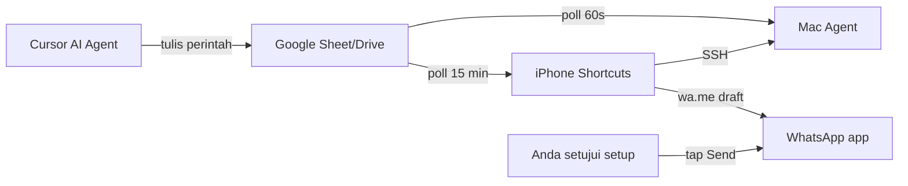

# Panduan Izin & Workaround Otomatisasi

Anda sudah **mengizinkan** — langkah berikut = cara **memberi akses legal** ke sistem Anda agar Automation Hub (dan AI) bisa membantu proses otomatisasi **tanpa** jailbreak atau hack WhatsApp.

> **Kejujuran teknis:** Cloud Agent **tidak bisa** remote desktop ke iPhone/WhatsApp Anda. Yang kita bangun = **jembatan** (Google Sheet + Shortcuts + webhook) sehingga perintah otomatisasi bisa jalan di perangkat Anda.

---

## Model Akses: Apa Arti "Izinkan"



| Yang Anda izinkan | Hasil |
|-------------------|-------|
| Shortcuts + Automation | iPhone eksekusi perintah dari Sheet |
| SSH Mac | iPhone/Mac saling kontrol |
| Google OAuth | AI baca/tulis antrian & log |
| Pushcut (opsional) | Trigger iPhone tanpa buka app |
| WhatsApp wa.me | Buka chat + draft (Anda tap Send) |

---

## BAGIAN 1 — Setup Mac (30 menit)

### 1.1 Install Hub

```bash
git clone https://github.com/Acimdamero/Acimdamero.git
cd Acimdamero/mac-iphone-automation
bash mac/install.sh
```

### 1.2 Izin sistem Mac

| Setting | Path | Set ke |
|---------|------|--------|
| Remote Login | System Settings → General → Sharing | **ON** |
| Full Disk Access (opsional) | Privacy → Full Disk Access → Terminal/iTerm | ON jika backup folder protected |
| Google Drive | Install + login akun sama dengan iPhone | Sync folder `Automation Hub/` |

### 1.3 SSH Key (iPhone → Mac tanpa password)

**Di Mac Terminal:**

```bash
# Generate key khusus automation (jika belum ada)
ssh-keygen -t ed25519 -f ~/.ssh/automation_hub -N ""

# Authorize
cat ~/.ssh/automation_hub.pub >> ~/.ssh/authorized_keys
chmod 600 ~/.ssh/authorized_keys

# Tampilkan public key — copy ke iPhone Shortcuts
cat ~/.ssh/automation_hub.pub
```

### 1.4 Config Hub

```bash
nano ~/.automation-hub/config.env
```

Isi `GOOGLE_SHEET_ID` dari URL Spreadsheet Anda.

### 1.5 Test

```bash
~/.automation-hub/run-task.sh status
~/.automation-hub/run-task.sh backup documents
```

---

## BAGIAN 2 — Setup Google (20 menit)

### 2.1 Buat Spreadsheet

Nama: **Automation Queue**

Tab wajib: `Queue`, `Devices`, `Inventory`, `Triggers` — lihat `google/SHEET-TABS-MAP.md`

### 2.2 Apps Script + Deploy Web App

1. Extensions → Apps Script → paste `google/apps-script/QueueSync.gs`
2. **Deploy → New deployment → Web app**
3. Execute as: **Me**
4. Who has access: **Only myself** (lebih aman) atau Anyone with link
5. **Copy Web App URL** → simpan di Notes iPhone

### 2.3 Izin Google di iPhone

- Install **Google Drive**, **Google Sheets** (opsional)
- Login **akun Google yang sama** dengan Mac
- Di Sheet: share hanya ke email Anda

### 2.4 Beri AI (Cursor) akses

1. Cursor → Settings → Models → Google API key → Verify
2. Copy `cursor/mcp.json.example` → `~/.cursor/mcp.json`
3. Restart Cursor → OAuth Google Drive saat diminta

**Setelah ini:** AI bisa baca log backup & menulis baris perintah baru di Sheet.

---

## BAGIAN 3 — Setup iPhone (45 menit)

### 3.1 Izin Shortcuts

| Setting | Path | Value |
|---------|------|-------|
| Allow Untrusted Shortcuts | Settings → Apps → Shortcuts | ON (jika import shortcut) |
| Siri & Search | Shortcuts app ON | |
| Background App Refresh | Settings → Shortcuts | ON |
| Notifications | Shortcuts | Allow |

### 3.2 Shortcut wajib (buat 4)

| Nama | Fungsi | Doc |
|------|--------|-----|
| Hub — Process iPhone Queue | Poll Sheet → eksekusi perintah | SHORTCUTS-GUIDE.md |
| Hub — Execute Command | Router perintah (if/else) | command-registry.json |
| Hub — WhatsApp Chat | wa.me open draft | WHATSAPP-GUIDE.md |
| Hub — Post iPhone Status | POST status ke webhook | status-post.shortcut-spec.json |

### 3.3 Automation wajib

**Automation 1 — Poll Queue**

- Trigger: **Time of Day** → Repeat every hour (atau 15 min manual dengan multiple automations)
- Action: Run **Hub — Process iPhone Queue**
- **Turn OFF "Ask Before Running"**

**Automation 2 — WiFi rumah**

- Trigger: **Wi-Fi** → jaringan rumah Anda
- Action: **Hub — Post iPhone Status**
- Run Immediately: ON

### 3.4 SSH ke Mac (izin remote)

Di Shortcut **Run Script Over SSH**:

- Host: `MacBook-Pro.local` atau Tailscale DNS
- User: username Mac
- Authentication: **SSH Key** → paste public key dari Mac
- Script: `~/.automation-hub/run-task.sh status`

**Ini = "izin" iPhone mengontrol Mac.**

---

## BAGIAN 4 — WhatsApp: Workaround Maksimal

WhatsApp **tidak punya API personal**. Workaround legal:

### Opsi A — Draft otomatis (gratis, cukup untuk kebanyakan workflow)

1. Buat **Hub — WhatsApp Chat** (lihat WHATSAPP-GUIDE.md)
2. Di Sheet tambah perintah:

```
device: iphone
command: whatsapp-chat
args: 6281234567890|Pesan otomatis dari Hub
```

3. iPhone poll → WhatsApp terbuka → **Anda tap Send** (1 tap)

**Ini bukan lemah — ini satu-satunya cara legal di WhatsApp personal iOS.**

### Opsi B — Pushcut (trigger lebih agresif)

Jika polling Sheet terlalu lambat:

1. Install [Pushcut](https://pushcut.io) di iPhone
2. Setup **Automation Server** (iPhone unlocked, charger, di rumah)
3. Mac/Apps Script POST ke:

```
https://api.pushcut.io/[SECRET]/execute?shortcut=Hub — WhatsApp Chat&input=628xxx|Pesan
```

4. Shortcut jalan **tanpa buka Shortcuts app** (lebih dekat ke "remote")

Biaya: Pushcut Pro ~$2.49/bulan untuk server extended.

### Opsi C — WhatsApp Business API (kirim 100% otomatis)

Hanya jika Anda **benar-benar butuh** kirim tanpa tap Send (notifikasi bisnis, alert sistem):

1. Daftar [Meta Business](https://business.facebook.com)
2. WhatsApp Business Platform → Cloud API
3. Nomor bisnis terpisah (bukan WhatsApp personal utama)
4. Server kirim via API — **beda** dari app di iPhone

Hub personal kita bisa trigger **Mac script** yang panggil Business API — tapi itu setup terpisah.

---

## BAGIAN 5 — "Token Izin" untuk Hub (Agar AI Bisa Bantu)

Buat file **hanya di Mac** (jangan commit ke GitHub):

```bash
mkdir -p ~/.automation-hub/secrets
chmod 700 ~/.automation-hub/secrets
```

### Simpan di Apple Keychain

```bash
# Webhook Apps Script URL
security add-generic-password -s automation-hub -a webhook-url -w "PASTE_WEB_APP_URL"

# Google Sheet ID
security add-generic-password -s automation-hub -a sheet-id -w "PASTE_SHEET_ID"
```

### Atau 1Password

Simpan item **Automation Hub** dengan field:
- `webhook_url`
- `sheet_id`
- `pushcut_secret` (opsional)

Script Hub sudah baca via `get_keychain_secret` / `get_op_secret`.

---

## BAGIAN 6 — Checklist "Sudah Diizinkan"

Centang saat selesai:

**Mac**
- [ ] `bash mac/install.sh` sukses
- [ ] Remote Login ON
- [ ] `run-task.sh status` jalan
- [ ] Google Drive sync folder Automation Hub

**Google**
- [ ] Sheet + Apps Script deployed
- [ ] Web App URL disimpan
- [ ] Tab Queue, Devices ada

**iPhone**
- [ ] 4 Shortcut Hub dibuat
- [ ] Automation poll queue (Ask Before Running OFF)
- [ ] SSH ke Mac tested
- [ ] Hub — WhatsApp Chat tested

**Cursor**
- [ ] Google API verified
- [ ] MCP Google Drive connected

**Opsional**
- [ ] Tailscale Mac + iPhone
- [ ] Pushcut Automation Server
- [ ] WhatsApp Business API

---

## BAGIAN 7 — Test End-to-End (Bukti Otomatisasi Jalan)

### Test 1: Mac status dari iPhone

Shortcut SSH → `run-task.sh status` → lihat JSON output.

### Test 2: iPhone terima perintah dari Sheet

1. Di Sheet manual append:

| id | device | command | status | args |
|----|--------|---------|--------|------|
| t1 | iphone | notify | pending | Hub test berhasil |

2. Tunggu automation poll (atau jalankan shortcut manual)
3. Notifikasi muncul di iPhone

### Test 3: WhatsApp draft

1. Sheet:

| device | command | status | args |
|--------|---------|--------|------|
| iphone | whatsapp-chat | pending | 628YOURNUMBER\|Test dari Automation Hub |

2. Poll → WhatsApp buka → tap Send

### Test 4: AI menulis perintah

Di Cursor chat:

> "Tambahkan perintah backup Mac ke Google Sheet queue"

(AI dengan MCP Drive/Sheet bisa bantu setelah terhubung.)

---

## Yang TIDAK Bisa Diakali (Meski Anda Izinkan)

| Permintaan | Kenapa |
|------------|--------|
| AI baca chat WhatsApp Anda | iOS sandbox — tidak ada API |
| Kirim WA tanpa tap Send (personal) | Apple + Meta policy |
| Agent cloud klik layar iPhone | Tidak ada remote access |
| Simpan password WA di Sheet | Tidak aman & tidak perlu |

---

## Ringkasan: Cara "Mengizinkan" yang Benar

1. **Pasang jembatan** (Mac agent + Sheet + Shortcuts) — bukan remote hack
2. **Matikan "Ask Before Running"** di automation iPhone
3. **SSH key** untuk Mac
4. **Webhook URL** untuk status & perintah
5. **WhatsApp** = draft via wa.me + 1 tap Send (atau Business API untuk full auto)
6. **Pushcut** jika butuh respons lebih cepat dari polling

Setelah checklist selesai, kirim ke saya:
- Apakah Test 1–3 berhasil?
- Error apa yang muncul?

Saya bantu debug langkah spesifik berdasarkan error tersebut.
