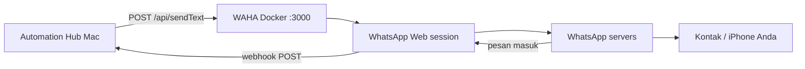
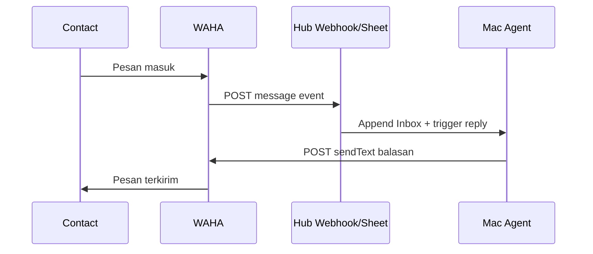

# WAHA API — Pelajaran & Integrasi Automation Hub

> **Catatan:** Anda menulis "API wafa" — yang dimaksud hampir pasti **[WAHA](https://waha.devlike.pro/)** (**W**hats**A**pp **H**TTP **A**PI), gateway self-hosted untuk otomatisasi WhatsApp via REST.

---

## WAHA vs Meta Cloud API vs iPhone Shortcuts

| Aspek | iPhone Shortcuts | Meta Cloud API (resmi) | **WAHA (self-hosted)** |
|-------|------------------|------------------------|-------------------------|
| Akun | Personal WA app | Business WABA + nomor bisnis | **Nomor personal** (scan QR) |
| Kirim otomatis | ❌ (1 tap Send) | ✅ | ✅ |
| Baca inbox | ❌ | ✅ webhook | ✅ webhook + GET messages |
| Balas otomatis | ❌ | ✅ | ✅ |
| Grup WA | Terbatas | ✅ (API groups) | ✅ `@g.us` |
| Setup | 5 menit | 1–3 jam (verifikasi bisnis) | **15 menit** (Docker + QR) |
| Biaya | Gratis | Per conversation Meta | Gratis (self-host) |
| Risiko ban | Rendah | Rendah (resmi) | **Sedang–tinggi** (unofficial) |
| Legal/ToS | ✅ | ✅ | ⚠️ Grey area |

**Kesimpulan:** WAHA = cara **mengakali** limit iOS/personal app dengan menjalankan WhatsApp Web di server/Mac, lalu expose REST API.

---

## Cara Kerja WAHA



1. WAHA jalankan headless **WhatsApp Web** (engine WEBJS/NOWEB/GOWS)
2. Anda **scan QR** sekali (seperti login web.whatsapp.com)
3. Hub kirim HTTP → WAHA kirim pesan **tanpa buka iPhone**
4. Pesan masuk → WAHA POST ke webhook Hub → auto-reply

---

## Install WAHA di Mac (Docker)

### Prasyarat

```bash
brew install --cask docker
# atau Docker Desktop dari docker.com
```

### Quick start

```bash
cd mac-iphone-automation
docker compose -f docker/docker-compose.waha.yml up -d
```

Buka dashboard: **http://localhost:3000**

### Scan QR (pairing)

```bash
# Buat session
curl -X POST http://localhost:3000/api/sessions/start \
  -H "X-Api-Key: YOUR_WAHA_API_KEY" \
  -H "Content-Type: application/json" \
  -d '{"name":"default"}'

# Ambil QR (buka di browser atau base64 decode)
curl http://localhost:3000/api/default/auth/qr \
  -H "X-Api-Key: YOUR_WAHA_API_KEY"
```

Scan dengan WhatsApp iPhone: **Settings → Linked Devices → Link a Device**

---

## API Penting WAHA

### Kirim teks

```http
POST http://localhost:3000/api/sendText
X-Api-Key: YOUR_KEY
Content-Type: application/json

{
  "session": "default",
  "chatId": "6281234567890@c.us",
  "text": "Pesan dari Automation Hub"
}
```

**chatId format:**
- Personal: `6281234567890@c.us` (tanpa `+`)
- Grup: `120363xxxx@g.us`

### Cek nomor valid

```http
GET http://localhost:3000/api/contacts/check-exists?phone=6281234567890&session=default
```

### Baca pesan (NOWEB/GOWS + store enabled)

```http
GET http://localhost:3000/api/default/chats/6281234567890@c.us/messages?limit=10
```

### Webhook (pesan masuk)

Set di docker env:

```
WAHA_WEBHOOK_URL=https://script.google.com/macros/s/XXX/exec?hub=waha
WAHA_WEBHOOK_EVENTS=message
```

Atau forward ke Mac lokal:

```
WAHA_WEBHOOK_URL=http://host.docker.internal:8765/waha/webhook
```

---

## Integrasi Automation Hub

Script sudah tersedia:

```bash
# Kirim via WAHA (personal account, full auto)
~/.automation-hub/run-task.sh waha-send 6281234567890 "Halo dari WAHA"

# Cek session WAHA hidup
~/.automation-hub/run-task.sh waha-status

# Backend switch — meta (resmi) atau waha (self-host)
# Di ~/.automation-hub/config.env:
WHATSAPP_BACKEND=waha
```

### Unified send (pilih backend otomatis)

```bash
~/.automation-hub/run-task.sh whatsapp-send 6281234567890 "Pesan"
# Membaca WHATSAPP_BACKEND=waha|meta
```

### Antrian Google Sheet

| device | command | status | args |
|--------|---------|--------|------|
| mac | waha-send | pending | 628xxx\|Pesan otomatis |
| mac | whatsapp-send | pending | 628xxx\|Pesan via Meta API |

---

## Auto-Reply Flow (inbox → balas otomatis)



Contoh rule di Apps Script tab `Rules`:

| keyword | reply |
|---------|-------|
| status | Mac online, backup terakhir 2 jam lalu |
| backup | Trigger mac/backup/all/pending |

---

## Engine WAHA — pilih yang mana?

| Engine | RAM | Stabilitas | Fitur |
|--------|-----|------------|-------|
| **WEBJS** | Tinggi | Baik (default) | Semua fitur media |
| **NOWEB** | Sedang | Baik | Bisa GET messages tanpa browser |
| **GOWS** | Rendah | Cepat | Go websocket, scalable |

Default di `docker-compose.waha.yml`: `NOWEB` (cocok untuk Mac daemon).

Set env: `WHATSAPP_DEFAULT_ENGINE=NOWEB`

---

## Risiko & Mitigasi (WAJIB dibaca)

| Risiko | Mitigasi |
|--------|----------|
| **Akun WA dibanned** | Jangan spam; max ~50–100 msg/hari personal; jeda antar pesan |
| Unofficial client | Pakai nomor cadangan, bukan nomor bisnis utama |
| Session putus | Docker restart policy + monitor `waha-status` |
| QR expire | Re-scan via dashboard |
| Data privacy | Self-host di Mac rumah, jangan expose port 3000 ke internet tanpa auth |

**WAHA sendiri menyatakan:** *"WhatsApp does not allow bots or unofficial clients — not totally safe."*

Untuk produksi bisnis → tetap gunakan **Meta Cloud API** (`whatsapp-send.sh` backend `meta`).

---

## Perbandingan strategi Hub Anda

```
Personal otomatisasi rumah     → WHATSAPP_BACKEND=waha
Bisnis / klien / scale         → WHATSAPP_BACKEND=meta
iPhone draft cepat             → whatsapp-chat (wa.me)
Instant trigger iPhone         → Pushcut
```

---

## Troubleshooting

| Error | Fix |
|-------|-----|
| Session not connected | Scan QR ulang |
| 401 Unauthorized | Set `WAHA_API_KEY` + header `X-Api-Key` |
| chatId invalid | Format `62xxx@c.us` tanpa + |
| Pesan tidak masuk webhook | Cek `WAHA_WEBHOOK_URL` reachable dari container |
| Docker port busy | Ganti `3000:3000` → `3001:3000` |

---

## Referensi

- [WAHA Docs](https://waha.devlike.pro/docs/)
- [GitHub devlikeapro/waha](https://github.com/devlikeapro/waha)
- [Meta Cloud API](https://developers.facebook.com/docs/whatsapp/cloud-api/)
- Hub: `mac/scripts/waha-send.sh`, `docker/docker-compose.waha.yml`
