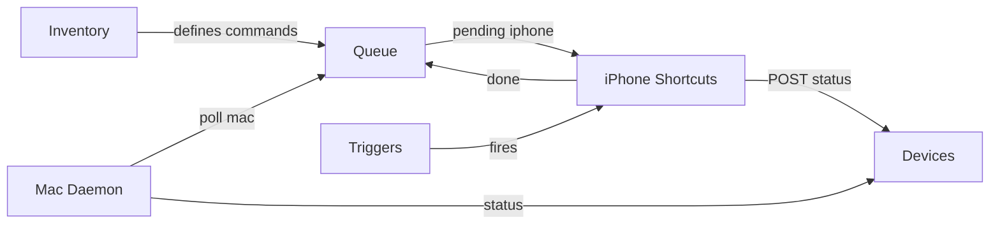

# Tab Google Sheet: Devices + Inventory

Tambahkan tab selain `Queue` untuk mapping dan monitoring iPhone/Mac.

---

## Tab: `Devices`

Log status real-time dari iPhone (`status-post` shortcut) dan Mac (`status.sh`).

| A (timestamp) | B (device) | C (battery) | D (wifi/network) | E (hostname) | F (extra) |
|---------------|------------|-------------|------------------|--------------|-----------|
| 2026-07-06T12:00:00Z | iphone | 87% | HomeWiFi | iPhone 15 Pro | |
| 2026-07-06T12:00:05Z | mac | AC | OfficeNet | MacBook-Pro | disk 45% used |

### Apps Script handler (tambahkan ke QueueSync.gs)

```javascript
function doPost(e) {
  const data = JSON.parse(e.postData.contents);
  if (data.action === 'status' || data.device) {
    return handleStatus(data);
  }
  appendCommand(data.device, data.command, data.args || '', 'pending');
  return ContentService.createTextOutput(JSON.stringify({ ok: true }))
    .setMimeType(ContentService.MimeType.JSON);
}

function handleStatus(data) {
  const ss = SpreadsheetApp.getActiveSpreadsheet();
  let sheet = ss.getSheetByName('Devices');
  if (!sheet) sheet = ss.insertSheet('Devices');
  if (sheet.getLastRow() === 0) {
    sheet.appendRow(['timestamp', 'device', 'battery', 'wifi', 'hostname', 'extra']);
  }
  sheet.appendRow([
    new Date().toISOString(),
    data.device || 'unknown',
    data.battery || '',
    data.wifi || data.network || '',
    data.name || data.hostname || '',
    data.extra || data.disk || ''
  ]);
  return ContentService.createTextOutput(JSON.stringify({ ok: true }))
    .setMimeType(ContentService.MimeType.JSON);
}
```

---

## Tab: `Inventory`

Audit app dan integrasi iPhone — isi manual saat survey Shortcuts.

| A (app) | B (category) | C (shortcuts_actions) | D (automatable) | E (hub_command) | F (notes) |
|---------|--------------|----------------------|-----------------|-----------------|----------|
| Safari | Browser | Open URL, Find Tab | yes | open-url | |
| Home | Smart Home | Run Scene | yes | homekit-scene | |
| Gmail | Google | Open app only | partial | open-url | Use Gmail in browser |
| Spotify | Media | Play/Pause | yes | run-shortcut | Buat sub-shortcut |
| Working Copy | Dev | Git Pull | yes | run-shortcut | |
| 1Password | Security | Find Password | manual | — | Never log passwords |

---

## Tab: `Triggers`

Mapping automation iPhone yang sudah dipasang.

| A (name) | B (trigger_type) | C (condition) | D (shortcut) | E (run_immediately) | F (enabled) |
|----------|-------------------|---------------|--------------|---------------------|-------------|
| Poll Queue | Time of Day | Every 15 min | Hub — Process iPhone Queue | yes | yes |
| Home Status | Wi-Fi | SSID Home | Hub — Post iPhone Status | yes | yes |
| Night Backup | Charger | Connected | Hub — Night Sync | yes | yes |
| Work Mode | Focus | Work ON | Hub — ssh-mac status | yes | yes |

---

## Relasi antar tab


